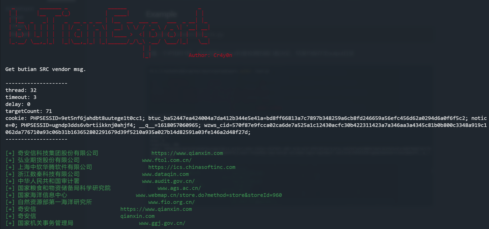

# buTianExport

使用多线程方式爬取补天平台SRC企业厂商信息，包含厂商名和域名，结果输出至表格。

```
OS：ALL
Python：Python 3
```

## Install

clone

```
https://github.com/Cr4y0nXX/buTianExport.git
```

or download zip

## Usage

因为需要获取Cookie，因此需要登陆补天众测平台，有两种方式来获取Cookie运行脚本：

1. 在Chrome上登陆补天平台，运行脚本会自动获取Cookie
2. 手动使用-c / --cookie参数指定cookie

以上两种方式均可。当出现爬取结果误差较大时，需刷新登陆页面获取一次新Cookie，同样Chrome直接刷新即可，其它浏览器刷新后复制，使用参数指定。

```
  _        _______ _             ______                       _
 | |      |__   __(_)           |  ____|                     | |
 | |__  _   _| |   _  __ _ _ __ | |__  __  ___ __   ___  _ __| |_
 | '_ \| | | | |  | |/ _` | '_ \|  __| \ \/ / '_ \ / _ \| '__| __|
 | |_) | |_| | |  | | (_| | | | | |____ >  <| |_) | (_) | |  | |_
 |_.__/ \__,_|_|  |_|\__,_|_| |_|______/_/\_\ .__/ \___/|_|   \__|
                                            | |
                                            |_|            Author: Cr4y0n
        
Get butian SRC vendor msg.

You need to login butian to get the Cookie, and you can directly run the program after logging in Chrome to get the Cookie automatically, or you can manually use the -c parameter to specify the Cookie. 

If the error of the crawling result is large, please refresh the page or specify a new Cookie        


usage: buTianExport.py [-h] [-sid STARTID] [-eid ENDID] [-T THREAD]
                       [-t TIMEOUT] [-s DELAY] [-c COOKIE]

optional arguments:
  -h, --help            show this help message and exit
  -sid STARTID, --startID STARTID
                        Number of thread, default is auto extract from site  起始页面ID，默认自动获取
  -eid ENDID, --endID ENDID
                        Number of thread, default is auto extract from site  终止页面ID，默认自动获取
  -T THREAD, --Thread THREAD
                        Number of thread, default is 32  线程，默认32
  -t TIMEOUT, --timeout TIMEOUT
                        Request timeout, default is 3 sec  请求超时，默认3秒
  -s DELAY, --delay DELAY
                        Delay between requests, default is 0 sec  延时请求，默认0秒
  -c COOKIE, --cookie COOKIE
                        Cookie of the domain butian.net, default is auto
                        extract from your chrome  指定Cookie，默认自动从Chrome获取
```

所有参数均为可选参数，都有默认值。

默认自动获取页面ID稍微有些慢，如果指定页面ID则快得多。

## Example

```
python buTianExport.py
```



感谢大佬的获取Chrome Cookie轮子！